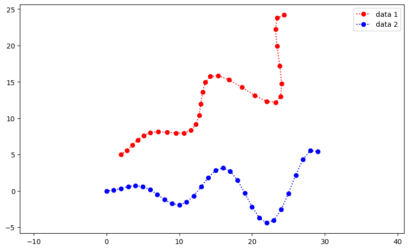

```python
import numpy as np
import matplotlib.pyplot as plt
```

# 1. Known data association


```python
def generate_data(num, angle = 0, t = np.zeros([2,1])):
    R = np.array([[np.cos(angle), -np.sin(angle)],
                  [np.sin(angle), np.cos(angle)]])
    data = np.zeros([2,num])
    data[0,:] = range(num)
    data[1,:] = 0.2 * data[0,:] * np.sin(0.5 * data[0,:])
    data = R @ data + t
    return data

def plot_data(data1, data2):
    fig = plt.figure(figsize=(10, 6))
    ax = fig.add_subplot(111)
    ax.axis('equal')
    ax.plot(data1[0], data1[1], color='red', marker='o', linestyle=":", label= "data 1")
    ax.plot(data2[0], data2[1], color='blue', marker='o', linestyle=":", label="data 2")
    ax.legend()
    return ax

data1 = generate_data(30, np.pi/180*30, np.array([[2],[5]]))
data2 = generate_data(30)
plot_data(data1, data2)
```


    <AxesSubplot: >


    

    


```python

```
